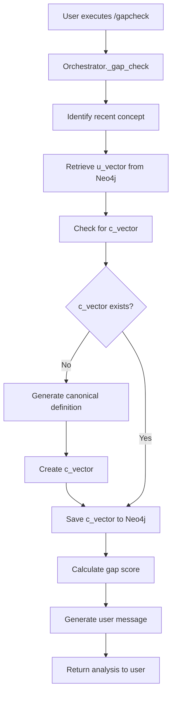
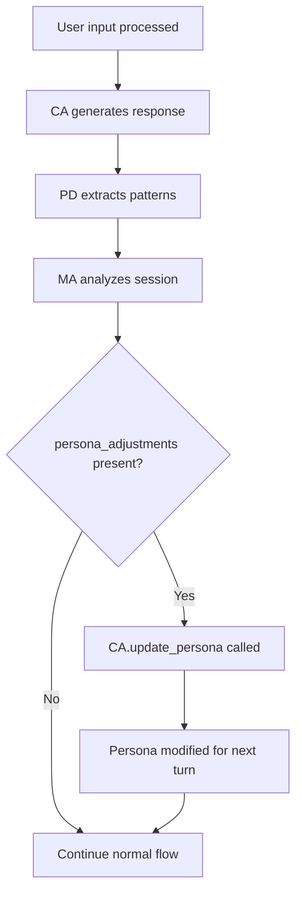
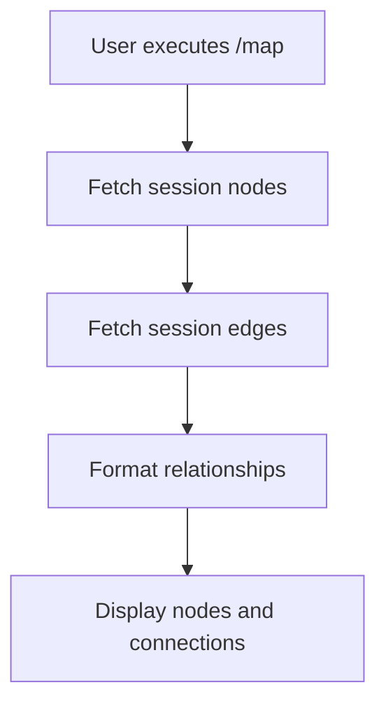

# Design Document

## Overview

The PEEngine core solidification involves implementing three critical missing features that will transform the system from a prototype to a fully functional learning tool. The design focuses on completing the `/gapcheck` command functionality, enabling active metacognitive influence on the conversational agent, and enhancing the `/map` command with relationship visualization. Additionally, comprehensive testing infrastructure will be established to ensure system reliability.

The implementation leverages the existing three-agent architecture (CA, PD, MA) and maintains the current async/await patterns, Neo4j knowledge graph storage, and MongoDB session management.

## Architecture

### Current System Architecture
The PEEngine follows a three-agent orchestration pattern:
- **Conversational Agent (CA)**: Socratic dialogue using metaphors
- **Pattern Detector (PD)**: Extracts concepts and relationships from conversations  
- **Metacognitive Agent (MA)**: Monitors sessions and provides system adjustments
- **Orchestrator**: Coordinates agent interactions and manages data flow
- **Embedding Service**: Handles vector operations for u-vectors and c-vectors

### Enhanced Architecture Components

#### 1. Gap Analysis System


#### 2. Metacognitive Influence System


#### 3. Enhanced Session Mapping


## Components and Interfaces

### 1. Enhanced Orchestrator Methods

#### `_gap_check()` Implementation
```python
async def _gap_check(self) -> Dict[str, Any]:
    """Check gaps between user understanding and canonical knowledge."""
    if not self.current_session or not self.current_session.messages:
        return {"error": "No active session or conversation to analyze"}
    
    # 1. Identify most recent concept
    recent_concept = await self._identify_recent_concept()
    if not recent_concept:
        return {"error": "No clear concept identified from recent conversation"}
    
    # 2. Retrieve u_vector
    u_vector = await self._get_user_vector(recent_concept)
    if not u_vector:
        return {"error": f"No user understanding vector found for '{recent_concept}'"}
    
    # 3. Get or create c_vector
    c_vector = await self._get_or_create_canonical_vector(recent_concept)
    
    # 4. Calculate gap
    gap_analysis = self.embedding_service.calculate_gap_score(u_vector, c_vector)
    
    # 5. Generate user message
    message = self._format_gap_message(recent_concept, gap_analysis)
    
    return {
        "concept": recent_concept,
        "similarity": gap_analysis["similarity"],
        "gap_score": gap_analysis["gap_score"],
        "severity": gap_analysis["severity"],
        "message": message
    }
```

#### Enhanced `process_user_input()` Method
The existing method will be modified to check for MA persona adjustments:

```python
# After MA analysis (existing code)
ma_analysis = await self.ma.analyze_session(...)

# NEW: Apply persona adjustments immediately
if ma_analysis.get("persona_adjustments"):
    await self.ca.update_persona(ma_analysis["persona_adjustments"])
    logger.info(f"Applied persona adjustments: {list(ma_analysis['persona_adjustments'].keys())}")
```

#### Enhanced `_show_session_map()` Method
```python
async def _show_session_map(self) -> Dict[str, Any]:
    """Show current session's concept map with relationships."""
    if not self.current_session:
        return {"error": "No active session"}
    
    # Fetch nodes (existing)
    nodes = []
    for node_id in self.current_session.nodes_created:
        node_data = self.graph_db.get_node(node_id)
        if node_data:
            nodes.append(node_data)
    
    # NEW: Fetch edges
    edges = []
    for edge_id in self.current_session.edges_created:
        edge_data = self.graph_db.get_edge(edge_id)
        if edge_data:
            edges.append(edge_data)
    
    return {
        "session_id": self.current_session.id,
        "topic": self.current_session.topic,
        "nodes": nodes,
        "edges": edges,  # NEW: Include edges
        "connections": len(self.current_session.edges_created)
    }
```

### 2. Enhanced Embedding Service Methods

#### `generate_canonical_definition()` Enhancement
The existing method will be enhanced with better domain-specific prompting:

```python
async def generate_canonical_definition(self, concept: str, domain: str) -> str:
    """Generate canonical definition for creating c-vector."""
    
    prompt = f"""
Provide a precise, canonical definition of "{concept}" in the {domain} domain.

Requirements:
- Use formal academic terminology
- Include essential properties and characteristics  
- Be concise but comprehensive (2-3 sentences)
- Focus on widely-accepted understanding
- Avoid metaphorical language

Domain context: {domain}
Concept: {concept}

Definition:"""
    
    # Implementation continues with existing OpenAI call...
```

#### `create_c_vector()` Enhancement
The method will be enhanced to store the canonical definition alongside the vector:

```python
async def create_c_vector(self, concept: str, domain: str) -> Vector:
    """Create canonical academic vector (c-vector)."""
    
    # Generate canonical definition first
    canonical_definition = await self.generate_canonical_definition(concept, domain)
    
    # Create vector from definition
    c_text = f"Concept: {concept}\nDomain: {domain}\nCanonical definition: {canonical_definition}"
    embedding = await self._get_embedding(c_text)
    
    return Vector(
        values=embedding,
        model=self.model,
        dimension=len(embedding),
        metadata={"canonical_definition": canonical_definition}  # Store definition
    )
```

### 3. Enhanced CLI Display Functions

#### `display_session_map()` Enhancement
```python
def display_session_map(map_data: dict):
    """Display session concept map with relationships."""
    if 'error' in map_data:
        console.print(f"[red]{map_data['error']}[/red]")
        return
    
    # Display nodes table (existing)
    table = Table(title=f"Session Map: {map_data.get('topic', 'Unknown')}")
    table.add_column("Concept", style="cyan")
    table.add_column("Type", style="green") 
    table.add_column("Domain", style="yellow")
    
    for node in map_data.get('nodes', []):
        concept = node.get('label', 'Unknown')
        node_type = node.get('node_type', 'unknown')
        domain = node.get('properties', {}).get('domain', 'general')
        table.add_row(concept, node_type, domain)
    
    console.print(table)
    
    # NEW: Display relationships
    edges = map_data.get('edges', [])
    if edges:
        console.print("\n[bold]Relationships:[/bold]")
        for edge in edges:
            source_node = next((n for n in map_data['nodes'] if n['id'] == edge['source_id']), None)
            target_node = next((n for n in map_data['nodes'] if n['id'] == edge['target_id']), None)
            
            if source_node and target_node:
                source_label = source_node.get('label', 'Unknown')
                target_label = target_node.get('label', 'Unknown')
                edge_type = edge.get('edge_type', 'relates')
                
                console.print(f"  [cyan]{source_label}[/cyan] --({edge_type})--> [cyan]{target_label}[/cyan]")
    
    console.print(f"[dim]Total connections: {len(edges)}[/dim]")
```

### 4. Neo4j Client Enhancement

#### New `get_edge()` Method
```python
def get_edge(self, edge_id: str) -> Optional[Dict[str, Any]]:
    """Get an edge by ID."""
    query = "MATCH ()-[r:RELATES {id: $id}]-() RETURN r"
    
    with self.session() as session:
        result = session.run(query, {"id": edge_id})
        record = result.single()
        if record:
            return dict(record["r"])
        return None
```

## Data Models

### Enhanced Vector Model
```python
class Vector(BaseModel):
    """Vector representation for embeddings."""
    values: List[float]
    model: str = "text-embedding-ada-002"
    dimension: int = Field(default_factory=lambda: 1536)
    metadata: Dict[str, Any] = Field(default_factory=dict)  # NEW: Store additional data
```

### Gap Analysis Result Model
```python
class GapAnalysisResult(BaseModel):
    """Result of gap analysis between u-vector and c-vector."""
    concept: str
    similarity: float
    gap_score: float
    severity: str  # "low", "medium", "high"
    canonical_definition: str
    user_understanding_summary: str
    recommendations: List[str] = Field(default_factory=list)
```

## Error Handling

### Gap Check Error Scenarios
1. **No Active Session**: Return clear error message
2. **No Recent Concept**: Analyze conversation to identify discussable concepts
3. **Missing u_vector**: Suggest user engage more with the concept
4. **OpenAI API Failure**: Graceful degradation with cached definitions
5. **Neo4j Connection Issues**: Retry logic with exponential backoff

### Metacognitive Influence Error Scenarios
1. **CA Update Failure**: Log error but continue session
2. **Invalid Adjustments**: Validate adjustment format before applying
3. **Persona Corruption**: Maintain backup of base persona for recovery

### Session Map Error Scenarios
1. **Missing Nodes/Edges**: Display available data with warnings
2. **Database Inconsistency**: Attempt to repair or report specific issues
3. **Large Graph Rendering**: Implement pagination or filtering

## Testing Strategy

### Unit Tests Structure
```
tests/
├── test_orchestrator.py
├── test_embedding_service.py
├── test_cli.py
├── test_neo4j_client.py
└── test_integration.py
```

### Key Test Cases

#### Gap Check Tests
```python
async def test_gap_check_with_existing_vectors():
    """Test gap check when both u_vector and c_vector exist."""
    # Mock session with concept
    # Mock vector retrieval
    # Assert gap calculation
    # Verify message formatting

async def test_gap_check_creates_missing_c_vector():
    """Test gap check creates c_vector when missing."""
    # Mock session with concept
    # Mock missing c_vector
    # Mock canonical definition generation
    # Assert c_vector creation and storage
```

#### Metacognitive Influence Tests
```python
async def test_persona_adjustment_applied():
    """Test that MA persona adjustments are applied to CA."""
    # Mock MA analysis with adjustments
    # Process user input
    # Verify ca.update_persona was called
    # Check persona state change

async def test_metaphor_lock_detection():
    """Test MA detects metaphor lock-in pattern."""
    # Create session with repeated metaphor usage
    # Process multiple exchanges
    # Verify MA flags metaphor lock
    # Confirm persona adjustment triggered
```

#### Session Map Tests
```python
def test_session_map_includes_relationships():
    """Test that session map displays both nodes and edges."""
    # Mock session with nodes and edges
    # Call display_session_map
    # Verify both nodes and relationships are shown
    # Check formatting correctness
```

### Integration Tests

#### End-to-End Gap Check Flow
```python
async def test_complete_gap_check_flow():
    """Test complete gap check from user command to response."""
    # Start session
    # Have conversation about specific concept
    # Execute /gapcheck command
    # Verify meaningful response returned
    # Check database state
```

#### Metacognitive Influence Integration
```python
async def test_ma_influence_changes_ca_behavior():
    """Test that MA influence actually changes CA responses."""
    # Start session
    # Trigger specific MA flag (e.g., metaphor lock)
    # Capture CA response before and after
    # Verify behavioral change in CA responses
```

### Manual Testing Protocol

#### Complete User Journey Test
1. **Setup**: `peengine start "quantum mechanics"`
2. **Conversation**: Engage in 4-5 exchanges about quantum concepts
3. **Map Check**: Execute `/map` - verify nodes and relationships display
4. **Gap Analysis**: Execute `/gapcheck` - verify meaningful analysis
5. **Continued Conversation**: Use same metaphor repeatedly
6. **Behavior Change**: Observe CA prompting for new metaphors
7. **Session End**: Execute `/end` - verify clean completion

#### Error Scenario Testing
1. **Empty Session Gap Check**: Execute `/gapcheck` immediately after session start
2. **Network Failure**: Simulate OpenAI API failure during gap check
3. **Database Issues**: Test with Neo4j temporarily unavailable
4. **Large Session**: Test with 50+ exchanges for performance

## Performance Considerations

### Vector Operations Optimization
- Cache frequently accessed c_vectors in memory
- Batch vector similarity calculations when possible
- Use Neo4j vector indexes for efficient similarity search

### Session Map Scalability
- Limit displayed relationships to most relevant (top 20)
- Implement filtering by relationship type or strength
- Add pagination for sessions with many concepts

### Metacognitive Analysis Efficiency
- Limit conversation history analyzed to last 10 exchanges
- Cache MA analysis results to avoid redundant processing
- Use streaming responses for real-time feedback

## Security Considerations

### API Key Management
- Ensure OpenAI API keys are properly secured
- Implement rate limiting to prevent API abuse
- Add request timeout handling

### Data Privacy
- Ensure user conversation data is properly isolated
- Implement data retention policies for session cleanup
- Add option to exclude sensitive topics from analysis

### Input Validation
- Sanitize user inputs before processing
- Validate concept names and domains
- Prevent injection attacks in database queries